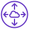

# AWS Resources Used in Cloud Networking

Descriptions and Examples for the following AWS Resources:

- Virtual Private Cloud (VPC)
- CIDR Range
- Subnets
- Internet Gateway (IGW)
- NAT Gateway
- Direct Connect/VPN
- VPC Peering
- Route Table
- Network Access Control List (NACL)

What is a VPC?

### VPC:

- Virtual Private Cloud
- Create a virtual networking environment
- Isolated section of your AWS services - keeps your stuff contained

It’s customisable:
- Private and public access (depending on what you’re architecting)
- IP ranges
- Security controls - NACL
- Connect to on premises infra via VPN/Direct connect - hybrid cloud
- Route Table
- Connect it to the internet or on premises infra
- NAT gateway - bastion/jumpbox
- VPC Peering (no transitive peering, you have to be explicit)

Your VPC sits inside a Region. Subnets sit inside a VPC.

NOTE: Your free AWS account comes with a default VPC and we’re going to create a custom VPC.

What is a CIDR Range?

  
### CIDR:

CIDR stand for Classless Inter-Domain Routing
  
CIDR is a shorthand method for representing a range of IP addresses.

Here are some examples of IP Addresses:

- 192.168.0.4
- 13.34.16.191

Here are some examples of CIDR Numbers:

- 127.0.0.0/24 means the same as 127.0.0/24 and means from to 127.0.0.0 to 127.0.0.255
- 14.0.0.0/8 means the same as 14/8 and means from to 14.0.0.0 to 14.255.255.255

CIDRs look very much like IP Addresses but they _are not the same thing_.

#### How does 14/8 mean 14.0.0.0 to 14.255.255.255?

An IP number is made up of 32 'bits' in binary. What 32/8 means is:

- the first 8 bits are fixed (in this case, the _14_).
- the remaining 24 bits (32 minus 8) will be variable (in this case the last three sets of numbers, which can all be 0,1,2,3,.... up to 255).

#### How does 127.0.0.0/24 mean 127.0.0.0 to 127.0.0.255?

Similar to the above:

- the first 24 bits are fixed (in this case, the _127.0.0_).
- the remaining 8 bits (32 minus 24) will be variable (in this case the last single set of numbers, which can 0,1,2,3,.... up to 255).

What are Subnets?

Pending Input

What is an Internet Gateway?

Pending Input

What is a NAT Gateway?

Pending Input

What is a Direct Connect/VPN?

Pending Input

What is VPC Peering?

Pending Input

What is a Route Table?

Pending Input

What is a NACL?

Pending Input

