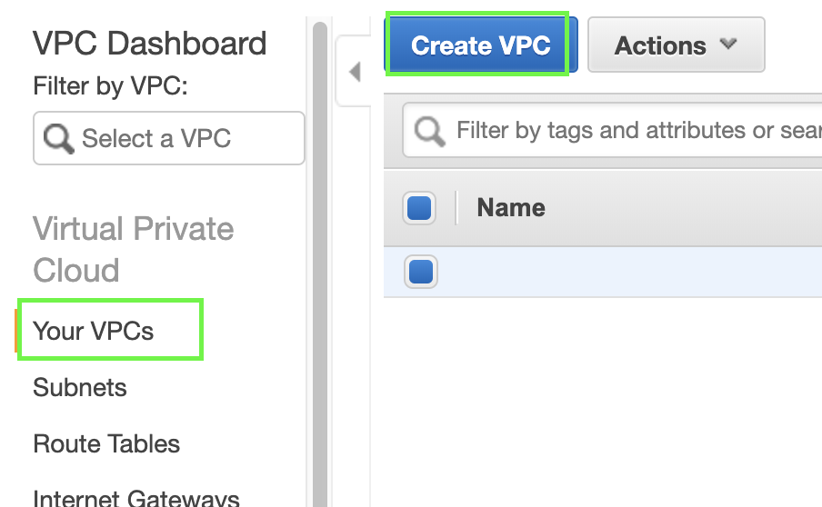
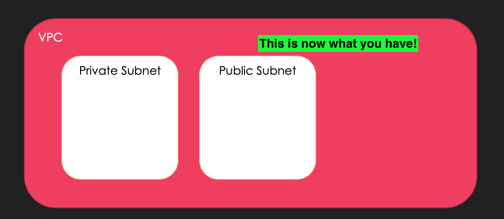
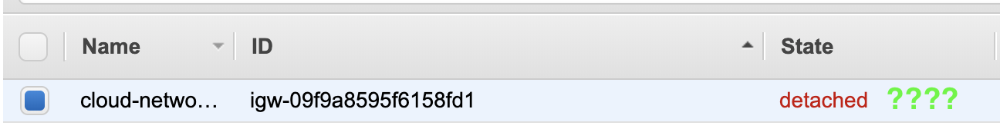
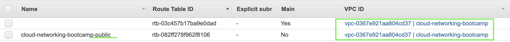
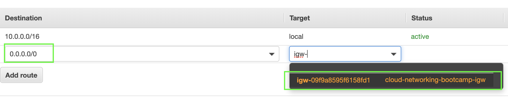
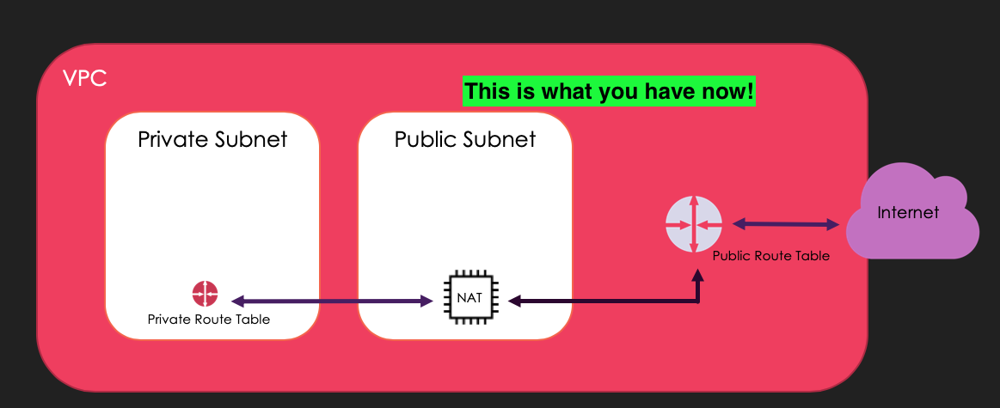
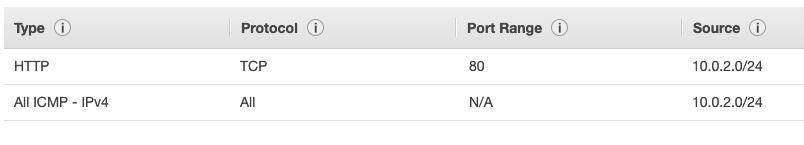
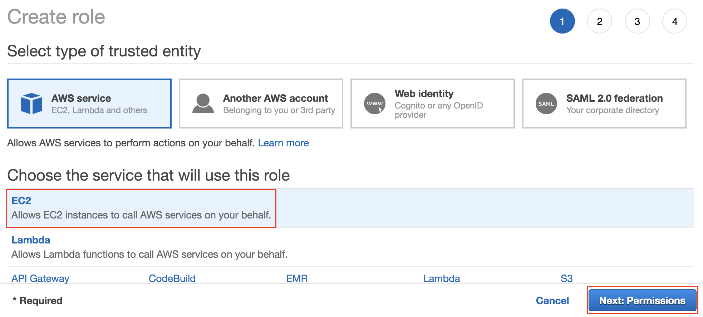
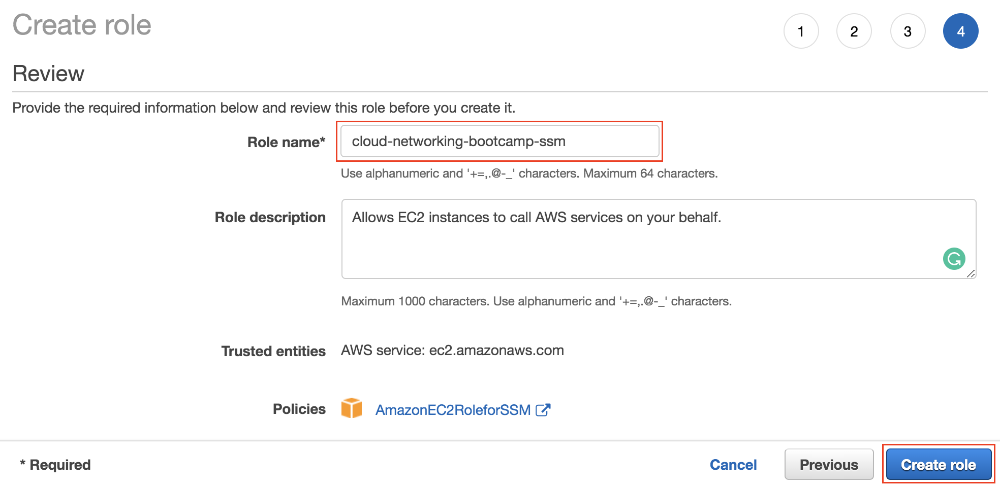

# Session 1 - Basic VPC Set-Up

By the end of this session you'll have:
  1. Virtual Private Cloud (VPC)
  2. Private Subnet
  3. Public Subnet
  4. NAT Gateway
  5. Route Table
  6. Internet Gateway (IGW)
  7. Security Group
  8. IAM Role for your SSM Agent

  ### Virtual Private Cloud (VPC)
  We're going to create a VPC for our webapp.

  Remember to check your Region, we're going to be choosing Sydney (ap-southeast-2)

  1. From the console go to Services > Networking and Content Delivery > VPC (or just search 'VPC' from Services)
  2. From the left, go to Your VPC's > Create VPC
  
  3. Fill in the fields > Create:
  - Name tag: __cloud-networking-bootcamp__
  - IPv4 CIDR block: __10.0.0.0/16__

*(The rest are kept as-is)*

  🌈 woo-hoo! You have created your VPC 🌈

When you create a VPC, it also creates the following, which we will need to configure:
- Route Table
- Network ACL
- Security Group

### Private and Public Subnets
Now that you have your VPC, let's create public (accessible by the internet) and private (for private data) subnets. It's always 1 subnet for 1 AZ in a VPC.

  1. From the console go to Services > Networking and Content Delivery > VPC > Subnets (or from the left, go to Subnets) > Create Subnet
  2. Choose your VPC from the drop down:
  
  3. Fill in the fields > Create:
  - Name tag: __cloud-networking-bootcamp-private__
  - IPv4 CIDR block: __10.0.1.0/24__
  - Availability Zone: __No preference__ 
  *(To stop one availability zone being overloaded, a, b and c AZ's are different for different accounts - otherwise most things would be deployed into AZ-a)*

  🔁 Repeat these steps, changing the fields to __cloud-networking-bootcamp-public__ and IPv4 to __10.0.2.0/24__

  🌈 woo-hoo! You have created your Public and Private Subnets 🌈

  

### Internet Gateway (IGW)
Let there be internet! Without an internet gateway, the cool stuff you create isn't accessible from the internet.

1. From the console go to Services > Networking and Content Delivery > VPC > Internet Gateways (or from the left, go to Internet Gateways) > Create Internet Gateway
2. Name tag: __cloud-networking-bootcamp-igw__
3. Create

  🌈 woo-hoo! You have created your IGW 🌈

...but wait, __detached__ ?

To attach our IGW to our VPC:
1. Select our IGW > Actions > Attach to VPC
2. Choose our cloud-networking-bootcamp VPC
3. Attach

NOTE: Only 1 IGW per VPC - so if you're having issues, make sure your VPC isn't already associated with another IWG

  🌈 woo-hoo! You have attached your IGW to your VPC 🌈

### NAT Gateway

__💵 NAT Gateways Cost Money 💵 So, make sure you delete this resource once done! Cost details: https://aws.amazon.com/vpc/pricing/__

1. From the console go to Services > VPC > NAT Gateways > Create NAT Gateway

2. Choose your __public__ subnet from the list and Create and  ENI 

  🌈 woo-hoo! You have created your NAT Gateway  🌈

### Route Tables
Time to configure your route table!

Here's the routes we need to make sure we configure:
- Your Public Subnet routes internet traffic via your Internet Gateway *(Public Route Table)*
- Your Private Subnet routes internet traffic via your NAT Gateway (which then forwards traffic out the Internet Gateway) *(Main or Default Route Table)*

Configuring your route tables
1. From the console go to Services > Networking and Content Delivery > VPC > Route Tables (or from the left, go to Route Tables) > Create Route Table
2. Name tag: __cloud-networking-bootcamp-public__ and select our VPC from the dropdown > Create

Now your should have 2 route tables that look like this...

👉🏽 At this point, you can re-name your Main route table to __private route table__

NOTE: Where *Main* is __Yes__ means it is the "main route table", which means anything new defaults to this route table. This means anything to be publicly routeable needs to be explicitly configured this way - this is good!

3. Select your __public route table__ > Edit routes > Add route
4. Fill in the fields: 
  - Destination: 0.0.0.0/0
  - Target: Internet Gateway > cloud-networking-bootcamp-igw
5. Select your __private route table__ > Edit routes > Add route
6. Fill in the fields: 
  - Destination: 0.0.0.0/0
  - Target: NAT Gateway > __Your NAT Gateway ID__

Now let's associate our __Public Subnet__ with our __Public Route Table__

7. Select your public route table > Subnet Associations tab > Edit subnet associations

8. Choose your public subnet > Save

🔁 Repeat these steps, but it will be your __Private Subnet__ associated with your __Private Route Table__

  🌈 woo-hoo! You have configured your route tables! 🌈

### Security Group for your Private Web Server
Now that we have our public and private zones of our VPC set up, we need to look at how we pass information securely between. For example, the load balances will require access to your web servers in the private subnet, but we don't want these web servers directly accessible from the Internet.

Security Group for a __Private__ web server
1. From the console go to Services > Networking and Content Delivery > VPC > Security Groups (or from the left, go to Security Groups) > Create Create Security Group
2. Fill in the fields > Create:

  - Security group name: __http_securitygroup__
  - Description: __Allows my ELB to talk to my web server__
  - VPC: __cloud-networking-bootcamp__

3. Create some rules for your new sg for *Inbound*:
  - Protcol: ICMP (allows you to ping a resource) __AND__ HTTP
  - Custom: *Your public subnet CIDR range* __10.0.2.0/24__
  __Anything that is associated with this security group can recieve HTTP and ICMP traffic from your public subnet - this is greate for your private webservers that are not directly connected to the internet__

### IAM Role for your SSM Agent

We're going to create an IAM role to give us SSM access to your EC2 instance. SSM will allow us to remotely access your instance.
__NOTE: we'll be using this role when we launch our EC2 instances in the next part__

1. From the Console, go to Services > Security, Identity, & Compliance > IAM 
2. On the left hand side, Click on Roles > Create role
3. Select AWS service, then EC2 as the service that will use this role
   
4. Filter the policies by searching for SSM. Select the policy named *AmazonSSMManagedInstanceCore*, then click Next until you reach the review page
   
   Name the role *cloud-networking-bootcamp-ssm* and check the correct policy was added, then click *Create role*
5. 

  🌈 woo-hoo! You have created a IAM role which allows you use SSM to manage your EC2 instances 🌈

### So what have we created?
By now you'll have:
  1. Virtual Private Cloud (VPC) ✅
  2. Private Subnet ✅
  3. Public Subnet ✅
  4. Route Tables ✅
  5. Internet Gateway (IGW) ✅
  6. Security Group ✅
  7. IAM Role for your SSM Agent ✅

Let's revise what we have created using a network diagram!

