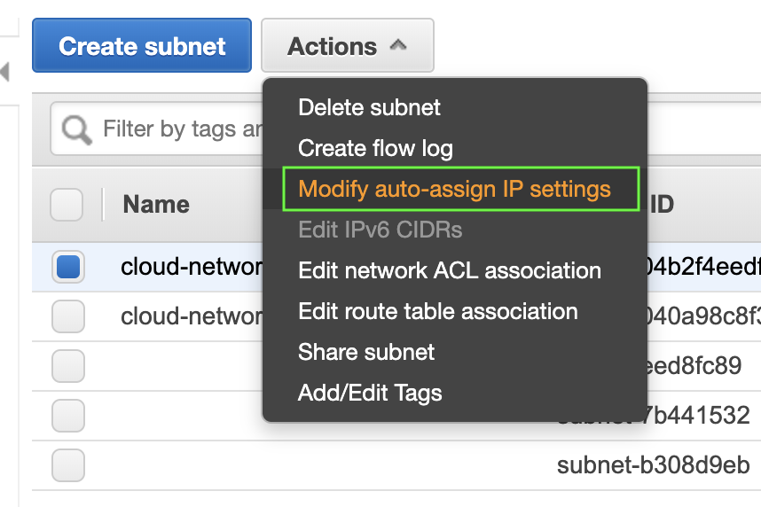
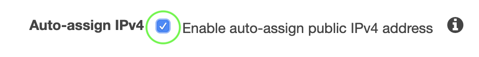
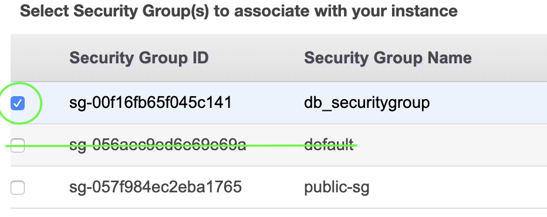

# Session 1 - Basic VPC Set-Up

By the end of this session you'll have:
  1. Virtual Private Cloud (VPC)
  2. Private Subnet
  3. Public Subnet
  5. Route Table
  6. Internet Gateway (IGW)
  7. Security Group

  ### Virtual Private Cloud (VPC)
  We're going to create a VPC for our webapp.

  Remember to check your Region, we're going to be choosing Sydney (ap-southeast-2)

    

  1. From the console go to Services > Networking and Content Delivery > VPC (or just search 'VPC' from Services)
  2. From the left, go to Your VPC's > Create VPC
  
  3. Fill in the fields > Create:
  - Name tag: __cloud-networking-bootcamp__
  - IPv4 CIDR block: __10.0.0.0/16__

*(The rest are kept as-is)*

  🌈 woo-hoo! You have created your VPC 🌈

When you create a VPC, it also creates the following, which we will need to configure:
- Route Table
- Network ACL
- Security Group

### Private and Public Subnets
Now that you have your VPC, let's create public (accessible by the internet) and private (for private data) subnets. It's always 1 subnet for 1 AZ in a VPC.

  1. From the console go to Services > Networking and Content Delivery > VPC > Subnets (or from the left, go to Subnets) > Create Subnet
  2. Choose your VPC from the drop down:
  
  3. Fill in the fields > Create:
  - Name tag: __cloud-networking-bootcamp-private__
  - IPv4 CIDR block: __10.0.1.0/24__
  - Availability Zone: __No preference__ 
  *(To stop one availability zone being overloaded, a, b and c AZ's are different for different accounts - otherwise most things would be deployed into AZ-a)*

  🔁 Repeat these steps, changing the fields to __cloud-networking-bootcamp-public__ and IPv4 to __10.0.2.0/24__

  🌈 woo-hoo! You have created your Public and Private Subnets 🌈

Extra Steps:
If you'd like a publicly-resolvable IP address associated with EC2's deployed into your __public__ subnet, then you'll need to edit the following settings:
1. Select __cloud-networking-bootcamp-public__ and from Actions, select Modify Auto-Assign IP Settings

2. Check the following box:

### Internet Gateway (IGW)
Let there be internet! Without an internet gateway, the cool stuff you create isn't accessible from the internet.

1. From the console go to Services > Networking and Content Delivery > VPC > Internet Gateways (or from the left, go to Internet Gateways) > Create Internet Gateway
2. Name tag: __cloud-networking-bootcamp-igw__
3. Create

  🌈 woo-hoo! You have created your IGW 🌈

...but wait, __detached__ ?

To attach our IGW to our VPC:
1. Select our IGW > Actions > Attach to VPC
2. Choose our cloud-networking-bootcamp VPC
3. Attach

NOTE: Only 1 IGW per VPC - so if you're having issues, make sure your VPC isn't already associated with another IWG

  🌈 woo-hoo! You have attached your IGW to your VPC 🌈

### Route Tables
Time to configure your route table!

Connecting your __Public subnet__ to the IGW
1. From the console go to Services > Networking and Content Delivery > VPC > Route Tables (or from the left, go to Route Tables) > Create Route Table
2. Name tag: __cloud-networking-bootcamp-public__ and select our VPC from the dropdown > Create

Now your should have 2 route tables that look like this...

NOTE: Where *Main* is __Yes__ means it is the "main route table", which means anything new defaults to this route table. This means anything to be publicly routeable needs to be explicitly configured this way - this is good!

3. Select your public route table > Edit routes > Add route
4. Fill in the fields: 
  - Destination: 0.0.0.0/0
  - Target: Internet Gateway > cloud-networking-bootcamp-igw

Now let's associate our __Public Subnet__ with our __Public Route Table__

5. Select your public route table > Subnet Associations tab > Edit subnet associations

6. Choose your public subnet > Save

  🌈 woo-hoo! You have associated your __public__ subnet with the IGW 🌈

Extra Steps:

🚀 Launch an EC2 instance into your private subnet

Follow these steps to create the EC2 to be deployed in the __public__ subnet:

1. Services > Compute > EC2 > Launch Instance
2. Choose *Amazon Linux 2 AMI* > t2.micro
3. Click *Next: Configure Instance Details*
4. Select the cloud-networking-bootcamp VPC and the associated public subnet
5. Next until you get to *Configure Security Group* > Create new Security Group
6. Security Group name: __public-sg__
7. Add rule > Type: HTTP (port 80)
8. Review and Launch > Launch
9. Create a new keypair > Key pair name: __cloud-networking-bootcamp__

🚀 Launch an EC2 instance into your public subnet

Follow these steps to create the EC2 to be deployed in the __private__ subnet, note there are some differences!

1. Services > Compute > EC2 > Launch Instance
2. Choose *Amazon Linux 2 AMI* > t2.micro
3. Click *Next: Configure Instance Details*
4. Select the cloud-networking-bootcamp VPC and the associated private subnet
5. Next until you get to *Configure Security Group* > Choose an exisiting Security Group
6. Select the *Default* security group
7. Review and Launch > Launch
8. Choose an *exisiting* Key pair > Key pair name: __cloud-networking-bootcamp__

Note: You can name your instances as *public* and *private* to make the next steps easier 🤔

### Security Group
Now that we have our public and private zones of our VPC set up, we need to look at how we pass information securely between. For example, your app will need access to the database, but we don't want to provide public access to private data.

Security Group for a __Private__ database
1. From the console go to Services > Networking and Content Delivery > VPC > Security Groups (or from the left, go to Security Groups) > Create Create Security Group
2. Fill in the fields > Create:

  - Security group name: __db_securitygroup__
  - Description: __Allows my EC2 to talk to my database__
  - VPC: __cloud-networking-bootcamp__

3. Create some rules for your new sg for *Inbound*:
  - Protcol: ICMP (allows you to ping a resource) __AND__ SSH
  - Custom: [Your public subnet CIDR range] __10.0.1.0/24__

  Note: For a webapp, you'd also include HTTP, HTTPS, MYSQL/Auror as well, but we just want to test our connectivity for starters.

4. Associate your EC2 that's been deployed in your __private__ subnet to this security group

  - Services > Compute > EC2
  - Select your private EC2 > Actions > Networking > Change Security Group
  - __deselect__ the default sg and select your new db_securitygroup

  🌈 woo-hoo! You have created a security group which allows traffic to securely access a private (db) server 🌈

### So what have we created?
By now you'll have:
  1. Virtual Private Cloud (VPC) ✅
  2. Private Subnet ✅
  3. Public Subnet ✅
  5. Route Table ✅
  6. Internet Gateway (IGW) ✅
  7. Security Group ✅

Let's revise what we have created using a network diagram!

