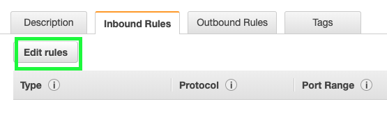
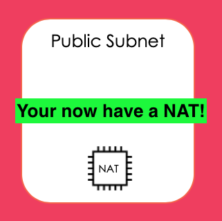

# Session 1 - Basic VPC Set-Up

By the end of this session you'll have:
  1. Virtual Private Cloud (VPC)
  2. Private Subnet
  3. Public Subnet
  4. NAT Instance Security Group
  5. NAT Instance
  6. Route Table
  7. Internet Gateway (IGW)
  8. Security Group

  ### Virtual Private Cloud (VPC)
  We're going to create a VPC for our webapp.

  Remember to check your Region, we're going to be choosing Sydney (ap-southeast-2)

  1. From the console go to Services > Networking and Content Delivery > VPC (or just search 'VPC' from Services)
  2. From the left, go to Your VPC's > Create VPC
  
  3. Fill in the fields > Create:
  - Name tag: __cloud-networking-bootcamp__
  - IPv4 CIDR block: __10.0.0.0/16__

*(The rest are kept as-is)*

  🌈 woo-hoo! You have created your VPC 🌈

When you create a VPC, it also creates the following, which we will need to configure:
- Route Table
- Network ACL
- Security Group

### Private and Public Subnets
Now that you have your VPC, let's create public (accessible by the internet) and private (for private data) subnets. It's always 1 subnet for 1 AZ in a VPC.

  1. From the console go to Services > Networking and Content Delivery > VPC > Subnets (or from the left, go to Subnets) > Create Subnet
  2. Choose your VPC from the drop down:
  
  3. Fill in the fields > Create:
  - Name tag: __cloud-networking-bootcamp-private__
  - IPv4 CIDR block: __10.0.1.0/24__
  - Availability Zone: __No preference__ 
  *(To stop one availability zone being overloaded, a, b and c AZ's are different for different accounts - otherwise most things would be deployed into AZ-a)*

  🔁 Repeat these steps, changing the fields to __cloud-networking-bootcamp-public__ and IPv4 to __10.0.2.0/24__

  🌈 woo-hoo! You have created your Public and Private Subnets 🌈

  

### NAT Instance Security Group

1. From the console go to Services > Networking and Content Delivery > VPC > Security Groups > Create Security Group
2. Fill in the fields > Create:
- Security group name: __nat-instance-networking-bootcamp__
- Description: __Allows inbound traffic from the public to private subnet__
- VPC: __[Choose the Networking Bootcamp VPC you just created]__
3. Click on the link to your newly created security group: __sg-XXXXXXXXXXX__
4. Click on Inbound Rules > Edit Rules > (for each rule) Add Rule

- Protocol: TCP, Port: 80, Source: IP of your __Private Subnet__
- Protocol: TCP, Port: 22, Source: Your own IP (Google, 'what's my ip?' to check)

5. Click Create

  🌈 woo-hoo! You have created your NAT Instance Security Group  🌈

### NAT Instance

1. From the console go to Services > EC2 > Launch Instance
2. AMI search __ami-0012a981fe3b8891f__ > Select (It should be named amzn-ami-vpc-nat-2018.03.0.20190826-x86_64-ebs, if you have trouble finding it, search for __nat__)
3. Select t2.micro > Next: Configure Instance Details
4. Fill in the details about your instance:
- Network: __[Choose the Networking Bootcamp VPC you just created]__ 
- Subnet: __Public Subnet__
- Auto-Assign Public IP: __Enable__
5. Next: Add Storage > Next: Add Tags > Next: Configure Security Group
6. Select an __exisiting__ security group > select __nat-instance-networking-bootcamp__ > Review and Launch
NOTE: If you get a prompt about General Purpose SSD, choose the recommended option and click 'Next'
7. Click Launch
8. 'Create a mew key pair' > Key pair name: __cloud-networking-keypair__
9. Launch Instances

  🌈 woo-hoo! You have created your NAT Instance  🌈

### Internet Gateway (IGW)
Let there be internet! Without an internet gateway, the cool stuff you create isn't accessible from the internet.

1. From the console go to Services > Networking and Content Delivery > VPC > Internet Gateways (or from the left, go to Internet Gateways) > Create Internet Gateway
2. Name tag: __cloud-networking-bootcamp-igw__
3. Create

  🌈 woo-hoo! You have created your IGW 🌈

...but wait, __detached__ ?

To attach our IGW to our VPC:
1. Select our IGW > Actions > Attach to VPC
2. Choose our cloud-networking-bootcamp VPC
3. Attach

NOTE: Only 1 IGW per VPC - so if you're having issues, make sure your VPC isn't already associated with another IWG

  🌈 woo-hoo! You have attached your IGW to your VPC 🌈

### Route Tables
Time to configure your route table!

Connecting your __Public subnet__ to the IGW
1. From the console go to Services > Networking and Content Delivery > VPC > Route Tables (or from the left, go to Route Tables) > Create Route Table
2. Name tag: __cloud-networking-bootcamp-public__ and select our VPC from the dropdown > Create

Now your should have 2 route tables that look like this...

NOTE: Where *Main* is __Yes__ means it is the "main route table", which means anything new defaults to this route table. This means anything to be publicly routeable needs to be explicitly configured this way - this is good!

3. Select your public route table > Edit routes > Add route
4. Fill in the fields: 
  - Destination: 0.0.0.0/0
  - Target: Internet Gateway > cloud-networking-bootcamp-igw

Now let's associate our __Public Subnet__ with our __Public Route Table__

5. Select your public route table > Subnet Associations tab > Edit subnet associations

6. Choose your public subnet > Save

  🌈 woo-hoo! You have associated your __public__ subnet with the IGW 🌈

### Security Group
Now that we have our public and private zones of our VPC set up, we need to look at how we pass information securely between. For example, the load balances will require access to your web servers in the private subnet, but we don't want these web servers directly accessible from the Internet.

Security Group for a __Private__ web server
1. From the console go to Services > Networking and Content Delivery > VPC > Security Groups (or from the left, go to Security Groups) > Create Create Security Group
2. Fill in the fields > Create:

  - Security group name: __http_securitygroup__
  - Description: __Allows my ELB to talk to my web server__
  - VPC: __cloud-networking-bootcamp__

3. Create some rules for your new sg for *Inbound*:
  - Protcol: ICMP (allows you to ping a resource) __AND__ HTTP
  - Custom: [Your public subnet CIDR range] __10.0.1.0/24__

  🌈 woo-hoo! You have created a security group which allows traffic to securely access a private (web/http) server 🌈

### So what have we created?
By now you'll have:
  1. Virtual Private Cloud (VPC) ✅
  2. Private Subnet ✅
  3. Public Subnet ✅
  4. Route Table ✅
  5. Internet Gateway (IGW) ✅
  6. Security Group ✅

Let's revise what we have created using a network diagram!

