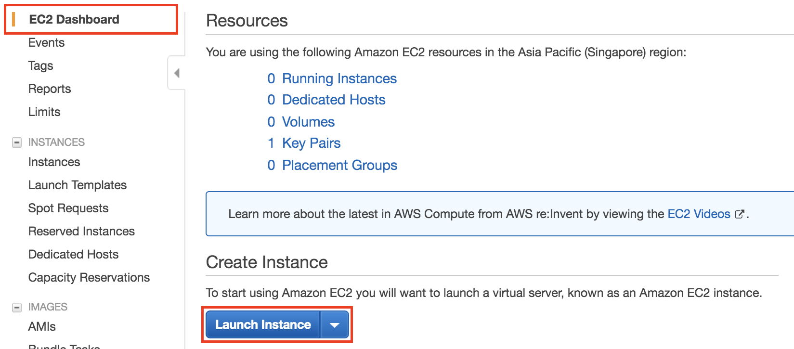
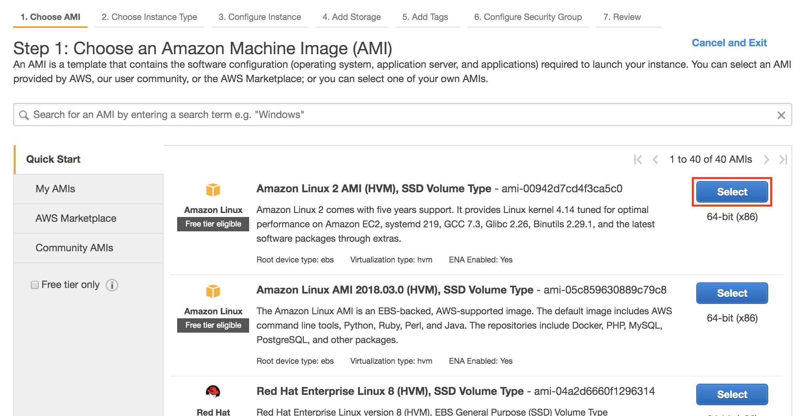
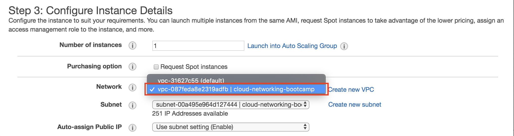
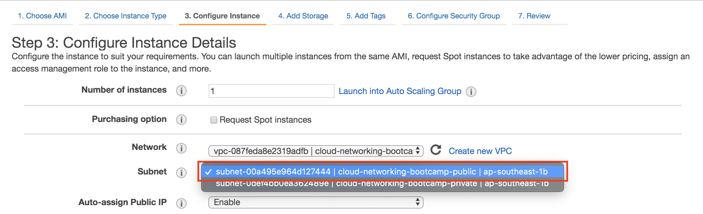
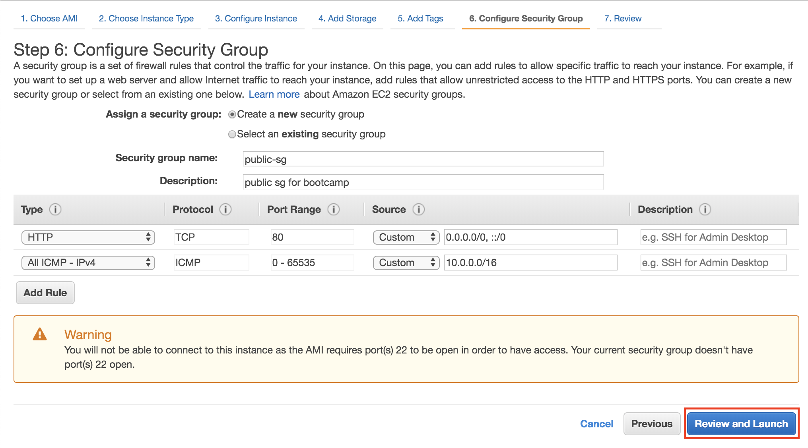
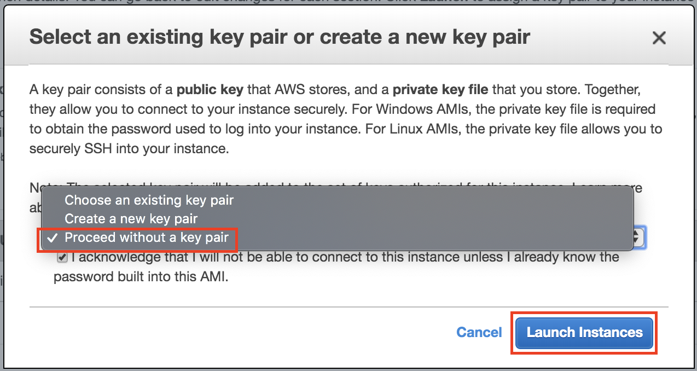
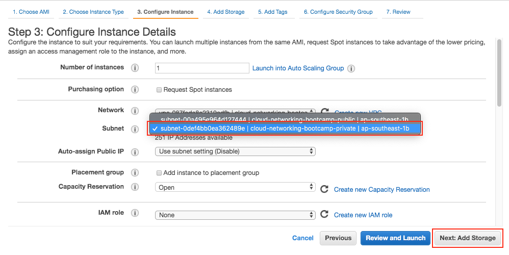
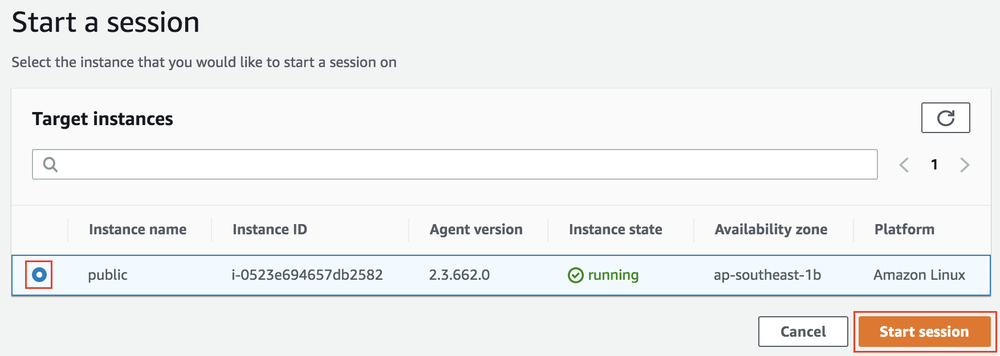

# Testing Your Network

By the end of this session you'll have:
  1. An EC2 in your public subnet
  2. An EC2 in your private subnet
  3. A way to remotely access your public EC2 instance using SSM
  4. A way to removely access your private EC2 instance via your public EC2 instance

### Create an IAM role for your public EC2 instance
We're going to create an IAM role to give us SSM access to your public EC2 instance. SSM will allow us to remotely access your instance.

1. From the Console, go to Services > Security, Identity, & Compliance > IAM 
2. On the left hand side, Click on Roles > Create role
3. Select AWS service, then EC2 as the service that will use this role
   
4. Filter the policies by searching for SSM. Select the policy named *AmazonEC2RoleforSSM*, then click Next until you reach the review page
   
   Name the role *cloud-networking-bootcamp-ssm* and check the correct policy was added, then click *Create role*
5. 

### 🚀 Launch an EC2 instance into your public subnet
We're going to deploy an EC2 instance into our public subnet create in the previous session. This EC2 will have access to the internet and will also be able to accept incoming connections from the internet.

Follow these steps to create the EC2 to be deployed in the __public__ subnet:

1. From the Console, go to Services > Compute > EC2 > Launch Instance
   
   note: ensure your region is still set to Sydney
2. Choose *Amazon Linux 2 AMI* > t2.micro
   
3. Click *Next: Configure Instance Details*
   
4. Select the cloud-networking-bootcamp VPC and the associated public subnet
   
   
5. Ensure that "Auto-assign Public IP" is set to "Enable"
6. Assign the IAM role created earlier with SSM permissions
   
7. Next until you get to *Configure Security Group* > Create new Security Group
8. Security Group name: __public-sg__
9.  Add rule > Type: HTTP (port 80)
10. Review and Launch 
    
11. Launch the instance
    
12. When the popup appears, select "proceed without a key pair", then click "Launce Instances"
    

### 🚀 Launch an EC2 instance into your private subnet
Follow these steps to create the EC2 to be deployed in the __private__ subnet, note there are some differences!

1. Follow steps 1-3 above for deploying an EC2 into your public subnet
4. Select the cloud-networking-bootcamp VPC and the associated private subnet
  
5. Next until you get to *Configure Security Group* > Choose an exisiting Security Group
6. Select the *Default* security group
  
7. Review and Launch > Launch
8. Create a *new* Key pair > Key pair name: __cloud-networking-bootcamp__
  
9. Click "Launce Instances" to launch your EC2 into the private subnet

Note: You can name your instances as *public* and *private* to make the next steps easier 🤔

### Connecting to your public EC2 Instance

1. From the console, go to Services > Management & Governance > Systems Manager
2. On the left hand side, select *Session Manager*
3. Click *Start Session* in the top right
4. There shiould be one instance name in the list (named public if you named it in the EC2 console). Select this instance, then click *Start session*
   
5. A new tab will open and you now have a terminal on your public EC2 instance!

### Test connectivity to your private EC2 instance
1. From the EC2 console, find the private IP address of your EC2 running in your private subnet
2. Test that you can ping this EC2 from your terminal by typing `ping 10.0.1.116` (you can press ctrl+c to stop this running)
3. You should also be able to access the internet (e.g. `ping google.com`)
4. Copy the private key downloaded above to your public EC2 instance
5. Connect to your private EC2 instance by typing `ssh -i key.pem ec2-user@10.0.1.116` (replace this with your own ec2 ip address)
6. You should now be connected to your private EC2 instance. You should be able to ping your public EC2 instance using its private ip address `ping 10.0.2.170` (remember to replace this ip address with your ip address)
7. if you try to ping anything on the internet, it should not work as you are in the private VPC that has no route to the internet. 