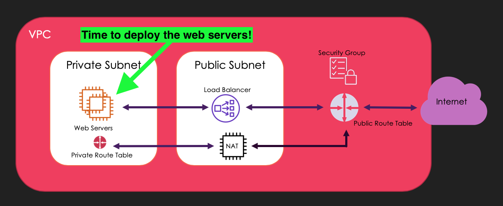

# Deploying Simple Webservers

We're going to deploy 2 webservers, webserver A and webserver B. The intent is that we will be able to hit a public end point and see the load being balanced between the webservers.

### 🚀 Launch 2 EC2 instance into your private subnet

1. Services > Compute > EC2 > Launch Instance
2. Choose *Amazon Linux 2 AMI* > t2.micro
3. Click *Next: Configure Instance Details*
4. Select the cloud-networking-bootcamp VPC and the associated public subnet
5. Next until you get to *Configure Security Group* > Create new Security Group
6. Security Group name: __private-sg__
7. Add rule > Type: HTTP (port 80), Source: 10.0.2.0/24 (your public subnet)
8. Review and Launch > Launch
9. Proceed without key pair

🔁 Repeat these steps!

🌈 Woo hoo! You have created 2 EC2 Instances! 🌈

### Let's test the connectivity of our EC2 Instances

We're going to use SSM to ping our EC2's. SSM is an agent to run a Systems Manager to connect to our EC2's.
Why ping? This will let us know if the correct route tables have been set up to access resources in our private subnet.

1. Services > Management & Governance > Systems Manager
2. Select __Session Manager__ on the left hand side
3. Select __Start Session__
4. Select your NAT instance from the list of instances
5. A new tab should open with a terminal on your NAT instance!
6. type `ping 10.0.1.x` (the IP address of one of your web servers launched above). You should see some responses come back from the web server
7. Press ctrl + c to stop pinging the server
8. try pinging your other web server to ensure that's also set up correctly

🌈 Woo hoo! You have tested your connection to your EC2 instances via your NAT Instance! 🌈

### Setting up your EC2 Instance as a Web Server
Using SSM you ssh into your EC2 instances, you're going to set them up as basic Apache web servers.

# To be updated

Make sure you have the right priviledges:

`sudo su`

Update your OS

`yum update -y`

Install an Apache server

`yum install httpd -y`

Start your web server

`service httpd start`

This command just makes sure your web server restarts if it stops

`chkconfig httpd on`

Let's edit our web server!

`cd /var/www/html`

if you `ls` you'll see an `index.html` file, we're going to edit this...

You can open `index.html` in nano:

`nano index.html`

This is the code we want in that file:

`<html><body>Hello from Web Server A!</body></html>`

Save and Exit nano

🔁 Repeat these steps for your 2nd EC2 instance (Web Server B), but change your index.html file to be `<html><body>Hello from Web Server B!</body></html>`

🌈 Woo hoo! You have made your EC2 Webservers! 🌈

### Let's now test our load balancer

Now that you have a public endpoint (your load balancer) and 2 web servers, we should be able to see the load balancer in action.
Expected behaviour is that as you refresh your end point, you will see 

