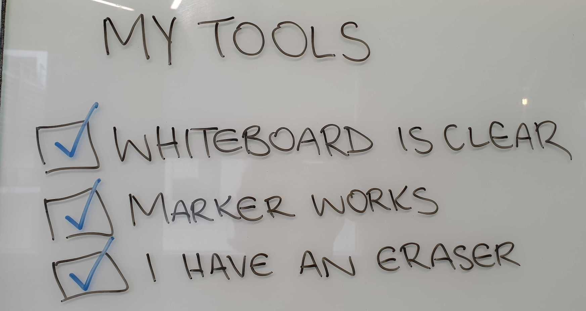
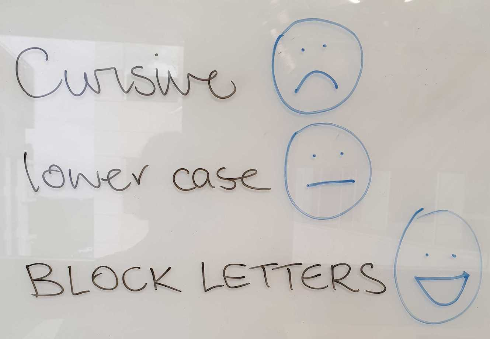
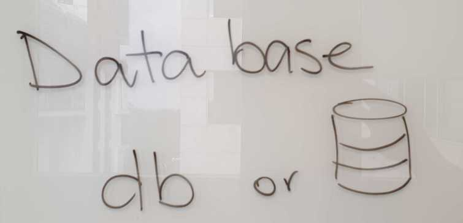
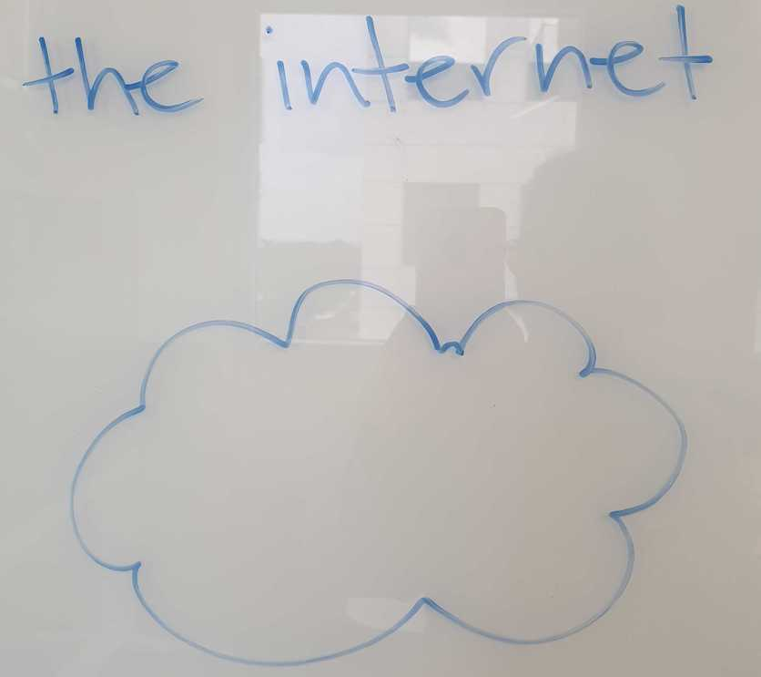

# Technical Whiteboarding Basics

To draw out a tech stack or articulating a technical problem using a whiteboard is a skill many experienced people take for granted. The aim of this session is to provide a starting point for developing your technical whiteboarding skills. For people who already have this in their toolkit, this session will hopefully encourage you to improve your existing skills.

What are the benefits of technical whiteboarding?

### Here's a short list of areas in your career where good whiteboarding skills are really helpful:

- A whiteboard can be a really useful tool to communicate ideas and problem solving
- It's common for an interviewer to ask an interviewee to whiteboard out a problem/tech stack/coding solution
- Incorporating a whiteboard into presentations/meetings can help keep things engaging and interactive
- Drawing things out on a whiteboard introduces a visual aspect to your conversations, making them multi-modal 

Some basics to be aware of

#### Tools
What are the tools for whiteboarding? Whiteboard and markers. For your whiteboarding session to be effective, do a quick check to ensure the board is clear (might need a more extensive clean) and your markers are working. Take the time to have the right tools, otherwise everything becomes a lot harder and you revert to just talking through things.

To make things more interactive, you can always incorporate sticky notes. The use of both whiteboard and sticky notes can be quite effective!

#### Plan
Planning what you're going to put on the whiteboard can be really useful for yourself and the audience. For example, you're about to draw a cloud network diagram for a web app that has a database, maybe you want to write a list of the components of your network. You can even use this as a checklist to make sure everything is present and accounted for. Talking out your plan can also act as a guage of whether you're on the right track (good for interviews) and sets expectations (good for meetings).

#### Handwriting
Work out what style of hand writing works best for you. Whiteboards don't act the same as a pen and paper. Writing in block letters is clearer than cursive. Remember that sometimes we take pictures of whiteboard discussions to reference later - so they need to be legible. 

Handwriting is terrible? Use more images to demonstrate what you're trying to get across eg. instead of writing 'database', maybe draw the symbol for a data base (see below)

#### Spacing
Be aware of the space you have to work with. If you're drawing a tech stack, do you have enough space to draw out each component vertically ↕️ ? Could you try horizontial ↔️ ? You might need to have a rough idea of how many layers/components you're planning to draw.
Have you left some space for some surprises to be added (external dependencies outside the stack)?

#### Use of Words vs Symbols
Do you find yourself writing a lot of words? Could some of this be substituted for symbols or acroynms? Any commonly used acroynms and their meaning can be documented in the corner for people to reference. This is about knowing your audience.

Try and keep your symbols simple and consistent. This means you can draw them quickly and the same symbol should be used for correlating components. 

Here are some helpful symbols that you can use in a tech stack or cloud network diagram, some are specific to AWS.

#### Talk it through 
Remember to talk through your thoughts as you are drawing. This can be hard to master, but here's some things to consider:
- It's harder to hear you when you're talking while facing the whiteboard
- Have you started talking about something that you haven't drawn yet? Is there enough context?
- If you're having to explain your symbols/words more often than not, you may need to revisit your choice of symbols/words
- Can people see what you have drawn while you're talking? Position yourself so people can see the whiteboard 👀

#### Make it Interactive
A great way to keep people engaged and to also help you when you're stuck is to ask questions. 

Not sure what the symbol for a lambda function is? You can ask, "does anyone know the best symbol for a lambda function?". This is also a good way to all agree on a symbol that may not have been obvious if you came up with one by yourself.

Let's try an exercise!

### In a small group, we're going to whiteboard some of the concepts we have learnt today! 👩🏾‍🏫

*TASK: As a group, you will be whiteboarding the cloud network we created in AWS including all of the components. Multiple people can be drawing, but always as a coordinated effort, talking through your thoughts and asking each other questions. The key is that you are all engaged and standing by the whiteboard.*

### Things to consider:
- If you need 5 minutes to read over things and discuss, do this before starting
- Help each other out if you feel like someone's stuck
- Make space for each other and don't take over
- Communication is key
- It's ok if you don't know something, you can indicate uncertainty in your whiteboard drawing

Resources:

https://medium.com/graphicfacilitation/two-simple-techniques-to-dramatically-improve-your-whiteboard-skills-a391534a8140
https://medium.com/@perrysetgo/death-of-a-whiteboard-how-to-crush-any-technical-interview-2e83a8b2149