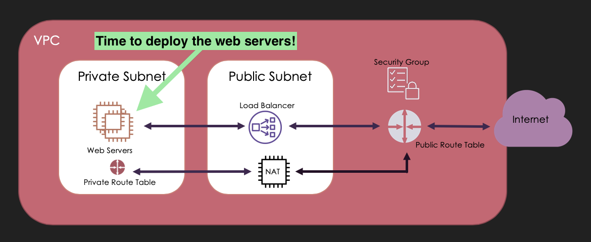
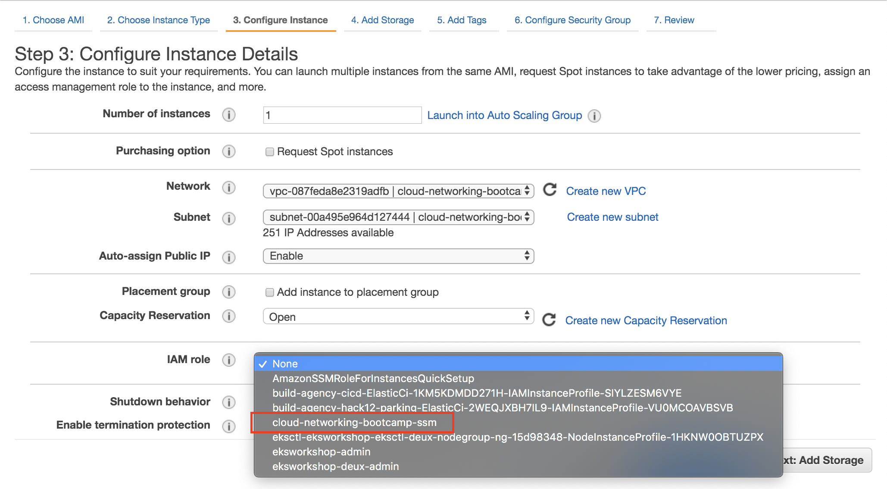
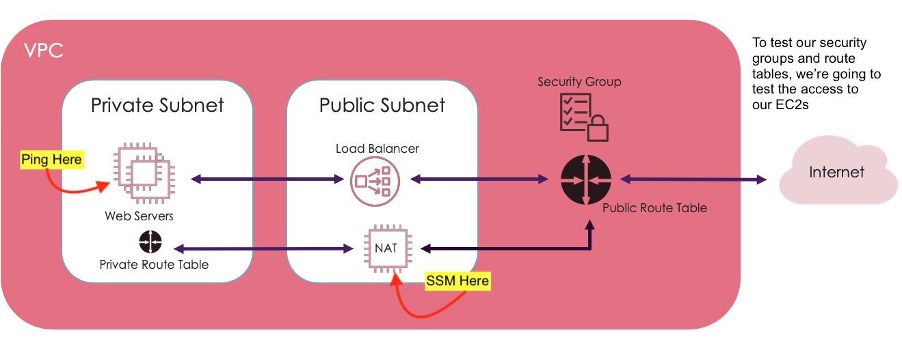
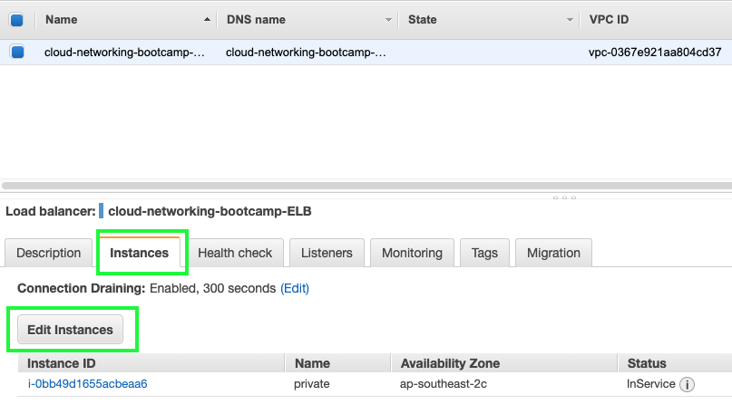
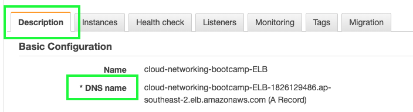
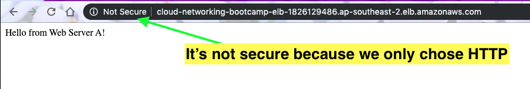
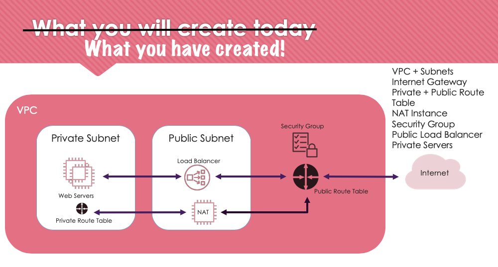

# Deploying Simple Webservers

By the end of this session you'll have:
  1. 2 EC2's in your __private__ subnet
  2. 1 EC2 in your __public__ subnet
  3. The ability to ping your private EC2's using a jumpbox
  4. The ability to test your ELB using Webserver A and B

We're going to deploy 2 webservers, webserver A and webserver B. The intent is that we will be able to hit a public end point and see the load being balanced between the webservers.

### 🚀 Launch two EC2 instances into your private subnet
These two instances will be our two web servers

1. Services > Compute > EC2 > Launch Instance
2. Choose *Amazon Linux 2 AMI* > t2.micro
3. Click *Next: Configure Instance Details*
4. Select the cloud-networking-bootcamp VPC and the associated __private__ subnet
5. Assign the IAM role created earlier with SSM permissions
   
6. Next until you get to *Configure Security Group* > Select an existing security group
7. Security Group name: __http_securitygroup__ (this is the security group you created in 3.1 when setting up your VPC)
8.  Review and Launch > Launch
9.  Proceed without key pair > Launch

🔁 Repeat these steps!

🌈 Woo hoo! You have created 2 EC2 Instances! 🌈

Tip: give each of these instances a name in the EC2 console to make them easier to identify later. You can call them `webserver-A` and `webserver-B` to keep things simple

### 🚀 Launch 1 EC2 instance into your public subnet
This instance will serve as a jumpbox so that we can test connectivity from our public to our private subnet and confirm that our web servers are set up correctly.

1. Services > Compute > EC2 > Launch Instance
2. Choose *Amazon Linux 2 AMI* > t2.micro
3. Click *Next: Configure Instance Details*
4. Select the cloud-networking-bootcamp VPC and the associated __public__ subnet
5. Ensure that "Auto-assign Public IP" is set to "Enable"
6. Assign the IAM role created earlier with SSM permissions

1. Next until you get to *Configure Security Group* > Create new Security Group
2. Security Group name: __public-sg__
3. __No Rules needed for the Security Group, we're going to use SSM to connect__
4.  Review and Launch > Launch
5.  Proceed without key pair > Launch

### Let's test the connectivity of our EC2 Instances

We're going to use SSM to ping our EC2's. SSM is an agent that allows us to to connect to our EC2s using the Session Manager in the AWS Console.
Why ping? This will let us know if the correct route tables have been set up to access resources in our private subnet.

1. Services > Management & Governance > Systems Manager
2. Select __Session Manager__ on the left hand side
3. Select __Start Session__
4. Select your __public EC2__ instance from the list of instances
5. A new tab should open with a terminal on your NAT instance!
6. type `ping 10.0.1.x` You should see some responses come back from the web server (this should be the IP address of one of your web servers launched above. You can find the IP address of your web server instances in the EC2 under `Private IPs`. As we'll be using these addresses again later, it might be a good idea to note them down to avoid switching back and forth between tabs). 
7. Press `ctrl+c` to stop pinging the server
8. try pinging your other web server to ensure that's also set up correctly

🌈 Woo hoo! You have tested your connection to your EC2 instances via your public subnet! 🌈

### Setting up your EC2 Instance as a Web Server
Using SSM you ssh into your EC2 instances, you're going to set them up as basic Apache web servers.

SSM into either of your private machines, but note which one you're setting up first (you're going to repeat these steps for both). Once you have the terminal open:

1. Make sure you have the right privileges:

    `sudo su`

2. Update your OS

    `yum update -y`

3. Install an Apache server

    `yum install httpd -y`

4. This command just makes sure your web server restarts if it stops

    `systemctl enable httpd`

5. Start your web server

    `systemctl start httpd`

6. Let's edit our web server!

    `cd /var/www/html`

7. Let's create a file to edit `touch index.html`

    You can open `index.html` in nano:

    `nano index.html`

8. This is the code we want in that file:

    `<html><body>Hello from Web Server A!</body></html>`

9. Save and Exit nano (ctrl+x, then y)

10. Test your webserver is running:

  `curl localhost` 👉🏽 Response: `<html><body>Hello from Web Server A!</body></html>`
  
  OR 
  
  `systemctl status httpd` 👉🏽 Response: `Active: active (running) `

11. 🔁 Repeat these steps for your 2nd EC2 instance (Web Server B), but change your index.html file to be `<html><body>Hello from Web Server B!</body></html>`

🌈 Woo hoo! You have made your EC2 Webservers! 🌈

### Let's now test our web servers
1. Follow the instructions above to get a terminal on our public EC2 instance
2. Type `curl -v 10.0.1.x` where the IP is that of your first web server (you can find the IP address of your web server instances in the EC2 under `Private IPs`)
3. Inspect the text returned, it should say `Hello from Web Server A!`
4. Now try the same, but change the IP address to your second server
5. You should see in the response `Hello from Web Server B!` this time
   
🌈 Woo hoo! You have now confirmed that your two web servers have been correctly set up! 🌈

### Let's now assign our instances to our load balancer!

1. Services > EC2 > Load Balancers > Select your load balancer
2. Go to the 'Instances' Tab
3. Edit Instances

4. Choose the two __Private Web Servers__ from this list
5. Try out the ELB's endpoint via the 'Description' Tab
6. Copy and Paste your ELB's DNS name into a Web Browser

7. It should look something like this:

Now that you have a public endpoint to your load balancer and 2 web servers, we should be able to see the load balancer in action.
Expected behaviour is that as you refresh your end point, you will see a round-robin behaviour between webserver A and B.

🌈 Woo hoo! You have 2 web servers, connected to a load balancer and it works! 🌈

You should now have:
  - ✅ 2 EC2's in your __private__ subnet
  - ✅ 1 EC2 in your __public__ subnet
  - ✅ The ability to ping your private EC2's using a jumpbox
  - ✅ The ability to test your ELB using Webserver A and B

